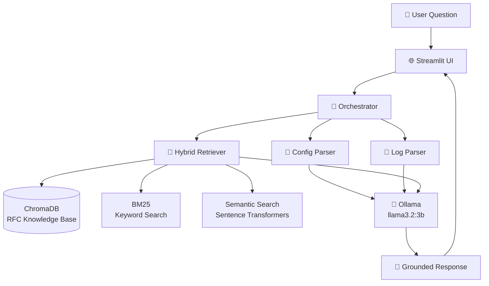

# 🌐 AI Network Copilot

A local Retrieval-Augmented Generation (RAG) assistant for network troubleshooting. It combines router configuration parsing, syslog analysis, and RFC knowledge retrieval to answer networking questions using grounded information rather than relying solely on an LLM's pretrained knowledge.

## ✨ Features

- **RAG over networking RFCs** – OSPF (RFC 2328), RIP (RFC 2453), and BGP (RFC 4271)
- **Hybrid retrieval** – combines semantic search (embeddings) with keyword search (BM25) using Reciprocal Rank Fusion (RRF)
- **Configuration parser** – extracts interfaces and routing protocol settings from Cisco-style configurations
- **Syslog parser** – detects OSPF/BGP adjacency changes, interface state changes, and STP events with severity classification
- **Grounded orchestration** – combines configuration data, log analysis, and RFC context into a single prompt
- **100% local inference** – powered by Ollama (`llama3.2:3b`), with no API costs
- **Streamlit UI** – upload router configurations and logs and receive streamed responses
- **Dockerized deployment** – run the entire application using Docker Compose
- **Retrieval evaluation framework** – compares semantic-only and hybrid retrieval against a ground-truth dataset

## 🧠 Architecture



## 🛠 Tech Stack

| Component | Technology |
|------------|------------|
| **Programming Language** | Python 3.11+ |
| **LLM** | Ollama (`llama3.2:3b`) |
| **LLM Framework** | LangChain |
| **Vector Database** | ChromaDB |
| **Embeddings** | Sentence-Transformers (`all-MiniLM-L6-v2`) |
| **Keyword Retrieval** | `rank_bm25` |
| **Hybrid Retrieval** | Reciprocal Rank Fusion (RRF) |
| **Frontend** | Streamlit |
| **Containerization** | Docker & Docker Compose |

## 📂 Project Structure

```text
ai-network-copilot/
│
├── .streamlit/
│   └── config.toml                 # Streamlit configuration
│
├── core/
│   ├── ingest.py                   # Builds the RFC vector database
│   ├── hybrid_retrieval.py         # Semantic + BM25 retrieval (RRF)
│   ├── config_parser.py            # Cisco configuration parser
│   ├── log_parser.py               # Syslog event parser
│   ├── orchestrator.py             # Combines retrieved context for the LLM
│   ├── rag_chat.py                 # RAG pipeline
│   ├── evaluate_retrieval.py       # Retrieval evaluation
│   └── query_test.py               # Retrieval testing utilities
│
├── data/
│   ├── chroma_db/                  # ChromaDB persistent vector store
│   ├── configs/                    # Sample router configurations
│   ├── logs/                       # Sample syslog files
│   └── rfc/                        # RFC source documents
│
├── frontend/
│   └── app.py                      # Streamlit web application
│
├── Dockerfile
├── docker-compose.yml
├── requirements.txt
├── .gitignore
├── .dockerignore
└── README.md
```

## 🚀 Running Locally

### Prerequisites
- Python 3.11+
- [Ollama](https://ollama.com) installed, with `llama3.2:3b` pulled (`ollama pull llama3.2:3b`)

### Setup

```bash
git clone <this-repo-url>
cd ai-network-copilot
python -m venv venv
venv\Scripts\activate   # Windows
pip install -r requirements.txt
```

### Ingest RFC knowledge base (first time only)

```bash
python core/ingest.py
```

### Run the app

```bash
streamlit run frontend/app.py
```

Open `http://localhost:8501` in your browser.

## Running with Docker

```bash
docker-compose up --build
```

This runs the app in a container while connecting to Ollama on your host machine.

## Evaluating retrieval quality

```bash
python core/evaluate_retrieval.py
```

Compares semantic-only vs. hybrid retrieval accuracy against a ground-truth test set of networking questions.

## Known limitations

- Small local LLM (3B params) can occasionally produce plausible-sounding but incorrect details not present in the source data (mitigated via strict prompting, but not eliminated)
- Hybrid retrieval improves some queries but not universally — see `evaluate_retrieval.py` results for a concrete, measured comparison against semantic-only search
- Currently supports Cisco-style config syntax only

## Author

Built by Konstantinos Bountourasas — Electrical & Computer Engineering, University of Peloponnese.