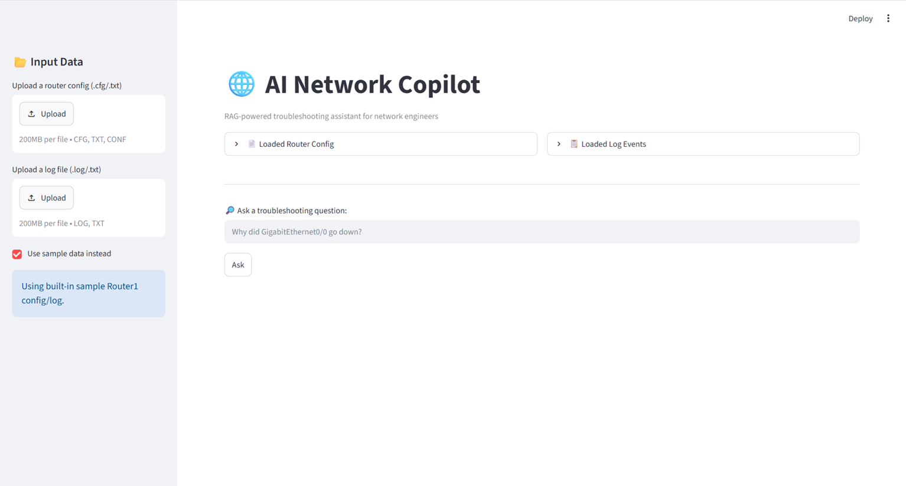
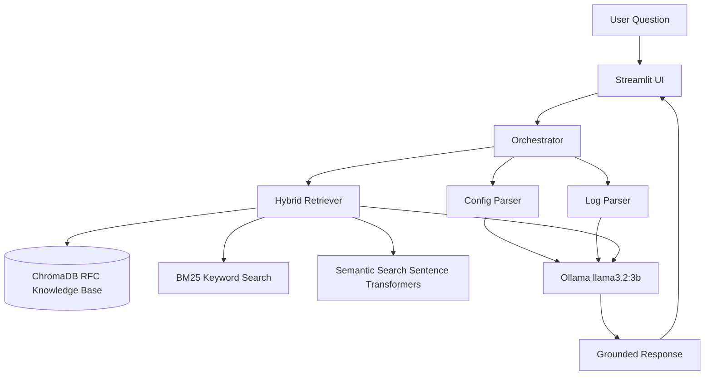

# AI Network Copilot


AI Network Copilot is a fully local Retrieval-Augmented Generation (RAG) assistant for network troubleshooting.

It analyzes Cisco-style router configurations, syslog events, and networking RFCs to answer operational networking questions with grounded, source-aware responses. The system combines hybrid retrieval, structured parsers, and local LLM inference through Ollama, making it suitable for offline experimentation, academic work, and privacy-preserving network diagnostics.

## Demo



## What It Can Answer

AI Network Copilot is designed to help with practical network troubleshooting questions such as:

- Why did my OSPF adjacency go down?
- Which interfaces are configured with OSPF?
- What does RFC 2328 say about OSPF neighbor states?
- Are there BGP session resets in this syslog file?
- Which routing events appear in the uploaded logs?
- How do the router configuration and syslog events relate to each other?
- What RFC context is relevant to this routing issue?

## Key Features

- **RAG over networking RFCs**: retrieves context from OSPF, RIP, and BGP RFC documents.
- **Hybrid retrieval**: combines semantic search with BM25 keyword search using Reciprocal Rank Fusion (RRF).
- **Cisco-style configuration parser**: extracts interfaces and routing protocol settings from uploaded router configs.
- **Syslog parser**: detects OSPF/BGP adjacency changes, interface state changes, and STP events.
- **Grounded orchestration**: combines config data, log analysis, and RFC context into one structured LLM prompt.
- **100% local inference**: uses Ollama with `llama3.2:3b`, avoiding external API calls and API costs.
- **Streamlit UI**: provides a simple interface for uploading configurations and logs.
- **Dockerized deployment**: runs through Docker Compose.
- **Retrieval evaluation framework**: compares semantic-only and hybrid retrieval against a ground-truth dataset.

## Key Differentiators

- Runs fully locally with Ollama.
- Uses both semantic and keyword retrieval instead of relying on vector search alone.
- Combines unstructured RFC knowledge with structured configuration and log parsing.
- Includes a retrieval evaluation script for measurable comparison.
- Focuses on a real networking workflow rather than a generic chatbot use case.

## Architecture



## Tech Stack

| Component | Technology |
| --- | --- |
| Programming Language | Python 3.11+ |
| LLM | Ollama `llama3.2:3b` |
| LLM Framework | LangChain |
| Vector Database | ChromaDB |
| Embeddings | Sentence Transformers `all-MiniLM-L6-v2` |
| Keyword Retrieval | `rank_bm25` |
| Hybrid Retrieval | Reciprocal Rank Fusion |
| Frontend | Streamlit |
| Containerization | Docker and Docker Compose |

## Project Structure

```text
ai-network-copilot/
|
├── .streamlit/
│   └── config.toml
|
├── core/
│   ├── ingest.py
│   ├── hybrid_retrieval.py
│   ├── config_parser.py
│   ├── log_parser.py
│   ├── orchestrator.py
│   ├── rag_chat.py
│   ├── evaluate_retrieval.py
│   └── query_test.py
|
├── data/
│   ├── chroma_db/
│   ├── configs/
│   ├── logs/
│   └── rfc/
|
├── frontend/
│   └── app.py
|
├── docs/
│   └── demo-screenshot.png
|
├── Dockerfile
├── docker-compose.yml
├── requirements.txt
├── .gitignore
├── .dockerignore
└── README.md
```

## Running Locally

### Prerequisites

- Python 3.11+
- Ollama installed
- `llama3.2:3b` pulled locally

Install the model:

```bash
ollama pull llama3.2:3b
```

### Setup

```bash
git clone https://github.com/KonstantinosBountou/ai-network-copilot.git
cd ai-network-copilot
python -m venv venv
```

Activate the virtual environment on Windows:

```bash
venv\Scripts\activate
```

Install dependencies:

```bash
pip install -r requirements.txt
```

### Ingest the RFC Knowledge Base

Run this once before using the app:

```bash
python core/ingest.py
```

### Run the App

```bash
streamlit run frontend/app.py
```

Then open:

```text
http://localhost:8501
```

## Running with Docker

Make sure Ollama is running on the host machine before starting Docker Compose.

```bash
ollama serve
```

In another terminal:

```bash
ollama pull llama3.2:3b
docker-compose up --build
```

The application will run in a container while connecting to the Ollama instance on the host machine.

## Retrieval Evaluation

The project includes a strict retrieval evaluation script that compares semantic-only retrieval with hybrid retrieval.

The evaluation checks whether the retrieved chunk comes from the correct RFC source and contains the required keyword or concept for each test question.

```bash
python core/evaluate_retrieval.py
```

Current evaluation run:

| Method | Result |
| --- | --- |
| Semantic-only retrieval | 9/12 = 75.0% |
| Hybrid retrieval with RRF | 8/12 = 66.7% |

Evaluation details:

| Test Question | Required Keyword | Semantic-only | Hybrid |
| --- | --- | --- | --- |
| Why does OSPF adjacency fail? | `dead` | Fail | Fail |
| What is the Designated Router in OSPF? | `designated router` | Pass | Pass |
| What are the OSPF neighbor states? | `exstart` | Pass | Fail |
| How does the Hello protocol work in OSPF? | `hello` | Pass | Pass |
| What is split horizon in RIP? | `split horizon` | Pass | Pass |
| What is the maximum hop count in RIP? | `16` | Fail | Fail |
| How does RIP handle routing loops? | `poison` | Fail | Fail |
| What is the purpose of BGP path attributes? | `path attribute` | Pass | Pass |
| What is the BGP hold timer? | `hold time` | Pass | Pass |
| How does BGP select the best path? | `decision` | Pass | Pass |
| What is an autonomous system in BGP? | `autonomous system` | Pass | Pass |
| Why would a BGP neighbor session reset? | `notification` | Pass | Pass |

In this strict test set, semantic-only retrieval performs slightly better than hybrid retrieval. This is useful because it shows that the project does not assume hybrid retrieval is always superior; instead, it measures retrieval behavior against a concrete ground-truth dataset.

## Example Workflow

1. Upload a Cisco-style router configuration file.
2. Upload a syslog file containing routing or interface events.
3. Ask a troubleshooting question through the Streamlit UI.
4. The app parses the uploaded files, retrieves relevant RFC context, and sends a grounded prompt to the local LLM.
5. The response is generated using the configuration, logs, and retrieved RFC passages.

## Known Limitations

- The local 3B parameter model can occasionally produce plausible-sounding but incorrect details that are not present in the source data.
- Hybrid retrieval improves some queries but may not outperform semantic-only search for every question.
- The configuration parser currently supports Cisco-style syntax only.
- The current RFC knowledge base focuses on OSPF, RIP, and BGP.

## Roadmap

- Add support for more routing protocols.
- Improve Cisco configuration parsing coverage.
- Add richer citation formatting in generated answers.
- Add unit tests for parsers and retrieval behavior.
- Support alternative local models.
- Add more sample troubleshooting scenarios.
- Improve evaluation with a larger ground-truth dataset.

## Suggested Repository Improvements

To make the repository look more complete on GitHub, consider adding:

- A real UI screenshot or GIF in `docs/demo-screenshot.png`.
- A `tests/` directory with unit tests for `config_parser.py` and `log_parser.py`.
- Actual retrieval evaluation results in the table above.
- A few sample input files under `data/configs/` and `data/logs/`.
- A short demo video link if available.

## Author

Built by [Konstantinos Bountourasas](https://github.com/KonstantinosBountou)  
Electrical and Computer Engineering, University of Peloponnese
